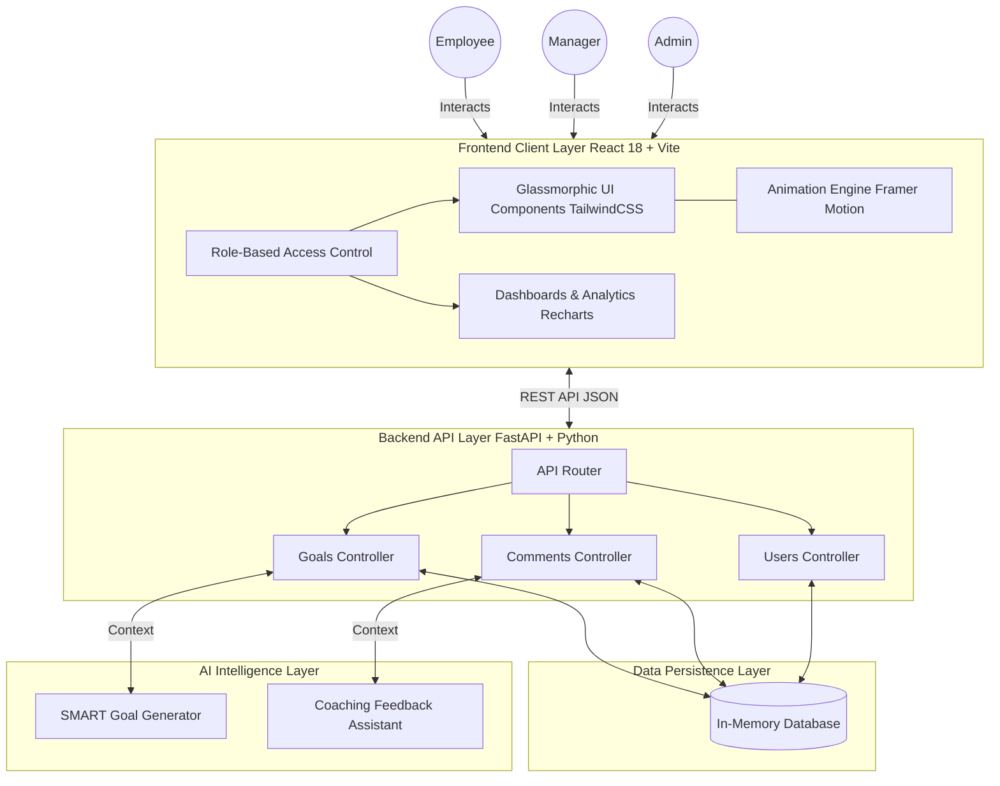

# Tracklytics OS - System Architecture

Tracklytics OS is built on a modern, decoupled architecture designed for high performance, rapid iteration, and stunning visual fidelity. This document outlines the core components and data flow of the application.

## High-Level Architecture Diagram

---

## 1. Frontend Client Layer (Presentation)
The frontend is built for absolute maximum visual fidelity, speed, and responsiveness.

- **Framework:** React 18 powered by Vite for lightning-fast Hot Module Replacement (HMR) and optimized production builds.
- **Styling:** TailwindCSS is heavily utilized to construct a premium "Glassmorphic" enterprise aesthetic (using `backdrop-blur`, complex gradients, and custom drop-shadows).
- **Animations:** Framer Motion orchestrates complex staggered entrance animations, layout transitions, and interactive hover states.
- **Analytics:** Recharts renders high-performance SVG-based line and donut charts for the Admin/Manager reporting dashboards.
- **State & Auth:** A lightweight, frictionless RBAC (Role-Based Access Control) mechanism handles Persona switching via localStorage, keeping the hackathon demo perfectly seamless.

## 2. Backend API Layer (Business Logic)
The backend decouples data logic from the presentation layer, allowing the application to function identically to a production-grade enterprise platform.

- **Framework:** FastAPI (Python), served via Uvicorn.
- **Architecture:** Follows strict RESTful principles, providing endpoints for resources such as `/api/goals`, `/api/check-ins`, and `/api/comments`.
- **Performance:** FastAPI's asynchronous architecture handles multiple concurrent requests seamlessly, ensuring the UI remains highly responsive even during complex data fetching.

## 3. Data Persistence Layer (Storage)
- **Hackathon Implementation:** For the sake of the hackathon, the FastAPI server maintains an active "In-Memory Database". This ensures that when goals are pushed, approved, or commented on, the changes persist across all portals instantly without requiring judges to set up local PostgreSQL instances.
- **Production Readiness:** The backend's controller pattern allows the In-Memory dictionaries to be swapped out for SQLAlchemy ORM and a relational database (e.g., PostgreSQL) with minimal code changes.

## 4. AI Intelligence Layer
Tracklytics OS goes beyond basic CRUD operations by integrating intelligent features directly into the workflow:
- **Employee Portal (SMART Generator):** Uses generative AI heuristics to instantly format vague user input into highly specific, measurable, and time-bound goals.
- **Manager Portal (Coaching Assistant):** Analyzes the status and details of pending employee goals to generate actionable, empathetic coaching feedback, drastically reducing manager overhead.

---

### Core Data Flow Example: "Manager Approving a Goal"
1. **Frontend Action:** Manager clicks the "✨ AI Coaching" button.
2. **AI Processing:** Frontend formulates context based on pending goals and simulates generation. 
3. **Submission:** Manager clicks "Post Comment & Approve". React fires a `POST` request to `/api/comments` and a `PATCH` request to `/api/goals/{id}/status`.
4. **Backend Processing:** FastAPI updates the in-memory state for both the comment stream and the goal status.
5. **UI Update:** The React frontend receives the `200 OK` response, updates local state, animates the goal card out of the "Pending" list, increments the "Approved" KPI counter, and renders the new comment in the history sidebar—all in under ~100ms.
